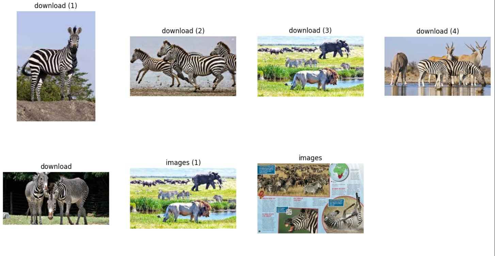
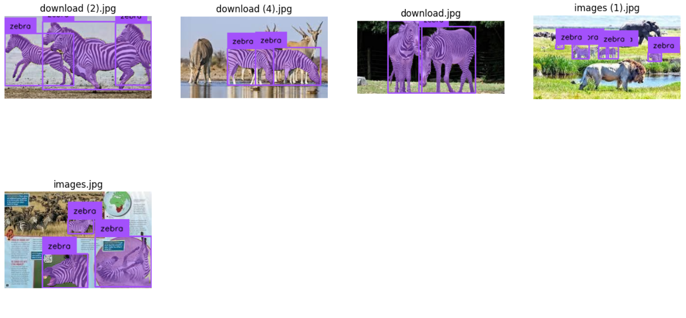
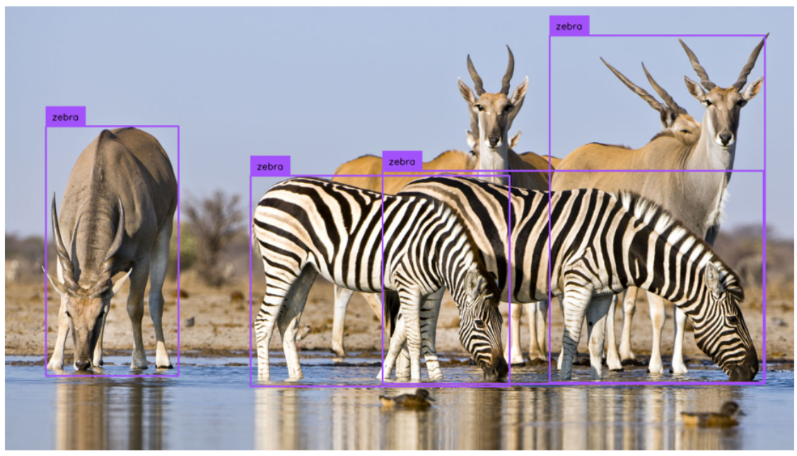

# autolabel-yolov8
A project that ultilize GroundedSAM model to annotate my dataset, using autodistill.

### Steps of the code:
- Start with a set of 7 zebra images (Fig.1)
- Use autodistill-GroundedSAM to label those images (Fig.2)
- Use the labeled image to train a YOLOv8 model
- See the performance of the trained YOLOv8 model on unseen image (Fig. 3)

---

Fig.1 Raw images

Fig.2 Images with-labels by GroundedSAM

Fig.3 Detections of YOLOv8 on unseen image

